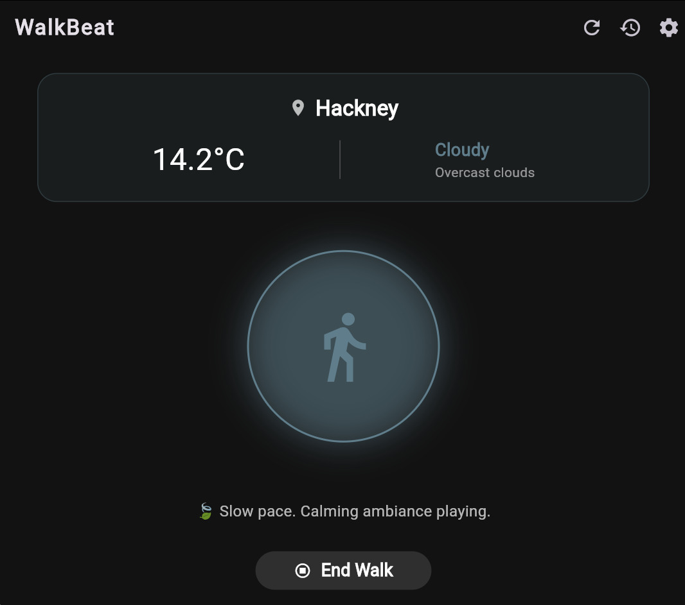
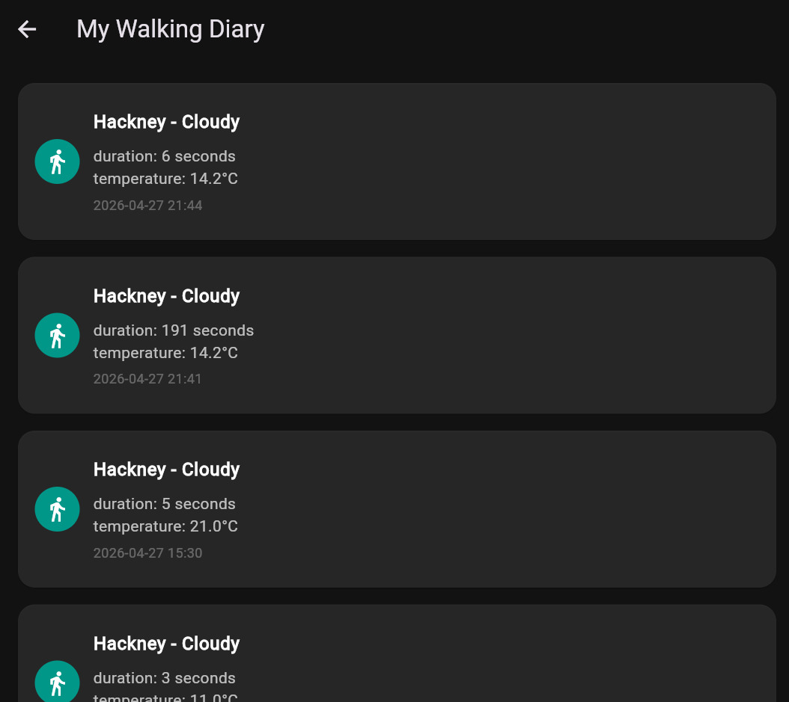
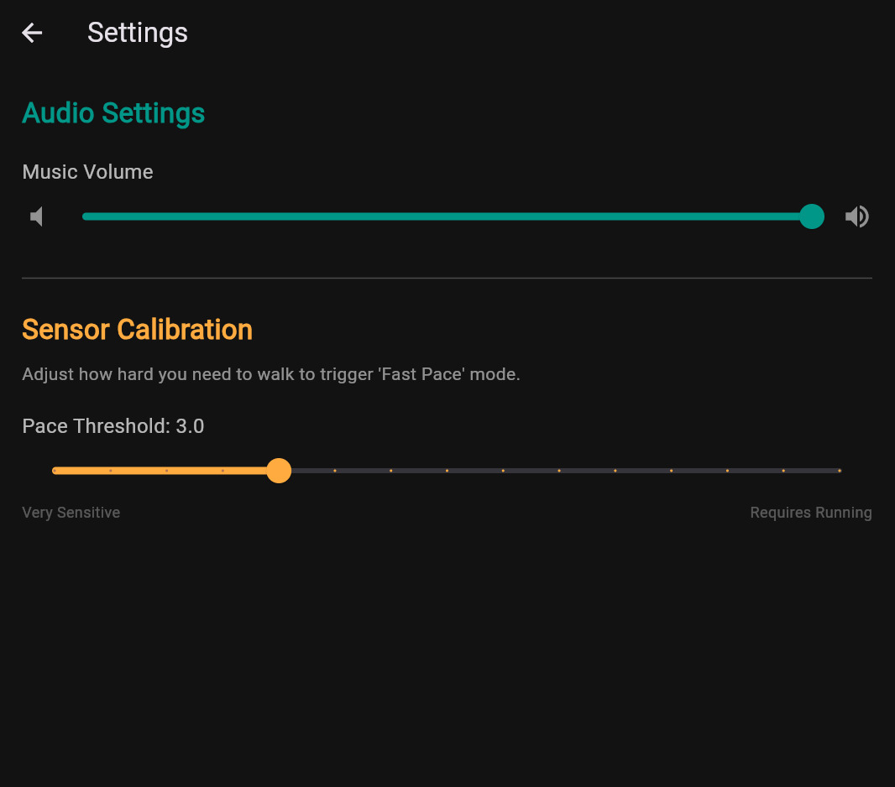

# 🎧 WalkBeat: Feel the Weather, Hear your Pace.

> **CASA0015: Mobile Systems & Interactions (2021/2022)**  
> A Flutter-based mobile application exploring context-aware soundscapes within the Connected Environment.

**🔗 [View HTML Page Here](https://xlogan123.github.io/CASA0015/)**  
**🎬 [Watch the 3-min Presentation Video Here]()**

---

## 🎯 1. Problem Statement
In modern urban life, commuting is often viewed as a mundane task. We walk from point A to B with our heads down, disconnected from our physical surroundings. 

**WalkBeat** aims to solve this by transforming walking into a mindful, interactive experience. By utilizing the concept of a **Connected Environment**, the app bridges the physical world (user's pace and local weather) with the digital world (dynamic UI and soundscapes), encouraging users to put their phones in their pockets and actually *feel* their environment.

## 📱 2. Screenshots
|     Home Screen (Cloudy)      |        Walk Diary (History)         |        Settings & Calibration         |
| :---------------------------------: | :---------------------------------: | :-----------------------------------: |
|  |  |  |
---

## 🧠 3. Overview of the Mobile App (Technical & UX)

### 🎨 Design & Storyboarding
The app is designed with a "glassmorphism" aesthetic and a dark theme to make the dynamic weather colors pop. The core narrative follows the user's journey: 
1. **Initiation**: The Splash Screen sets the mood.
2. **Exploration**: The Home Screen adapts its glowing UI and music tempo based on how fast the user is walking and what the sky looks like.
3. **Reflection**: The Walk Diary allows users to look back at their past journeys.

### ⚙️ Interactivity & Widgets
- **Visual Feedback**: Using `AnimatedContainer` and `AnimatedSwitcher`, the central ring breathes and expands seamlessly when the user transitions from walking to running. 
- **State Management**: The UI updates in real-time without crashing, ensuring a fluid user experience.

### 📡 Technical Integration (APIs & Sensors)
- **Physical Sensors**: Leverages the device's native accelerometer (`sensors_plus`). A custom math algorithm (vector magnitude) with debounce logic is implemented to accurately detect the walking pace while ignoring random hand shakes.
- **External API**: Integrates `geolocator` for GPS tracking and the **OpenWeather API** via RESTful HTTP requests to fetch real-time meteorological data and temperature.
- **Local Storage**: Uses `shared_preferences` to save custom sensor sensitivity and volume settings locally.

### ☁️ Data Collection & Management
To fulfill the requirement of logging data over time, WalkBeat seamlessly integrates with **Firebase Cloud Firestore**. 
- When a user finishes a walk, a JSON package containing `duration`, `city`, `weather`, and `temperature` is pushed to the cloud.
- The History Screen uses a `StreamBuilder` to fetch and display this data in real-time, functioning as a persistent cloud-based walk diary.

---

## 🚀 4. How to Run the Project

1. Clone this repository:
   ```bash
   git clone https://github.com/YourUsername/WalkBeat.git
2. Environment Setup:
    - Ensure you have the Flutter SDK installed and configured.
    - Verify your connection to Firebase (check `google-services.json` or `firebase_options.dart`).

3. Install Dependencies:
   ```bash
    flutter pub get
4. Run the Application:
    - For the best experience with sensor data (accelerometer), a physical device is highly recommended.
    - Execute the following command:
    ```bash
    flutter run
